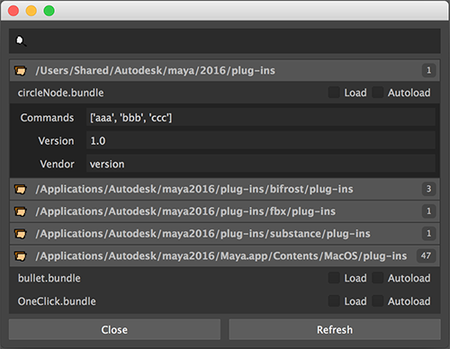

# Glade
Learning QThreads by writing a custom Maya plugin manager.

# Current state
The original point of this project was to learn how to use QThreads to process tasks in the background while emitting data to the UI thread. I got that working, which has been great, but this level of complexity isn't exactly required for this kind of project.

I'm gonna put this on hold for now. Maybe I can come back and tidy this up another day. Maybe, at the least, I can use it as reference for any future projects.

# Example launch code
```python
import sys

# Glade directory
path = "/Users/eddiehoyle/Code/python/glade"
if path not in sys.path:
    sys.path.insert(0, path)

from glade.view import window;reload(window)
win = window.GladeWindow()
win.show()
```

# Screenshot


_plug it in, plug it in_
